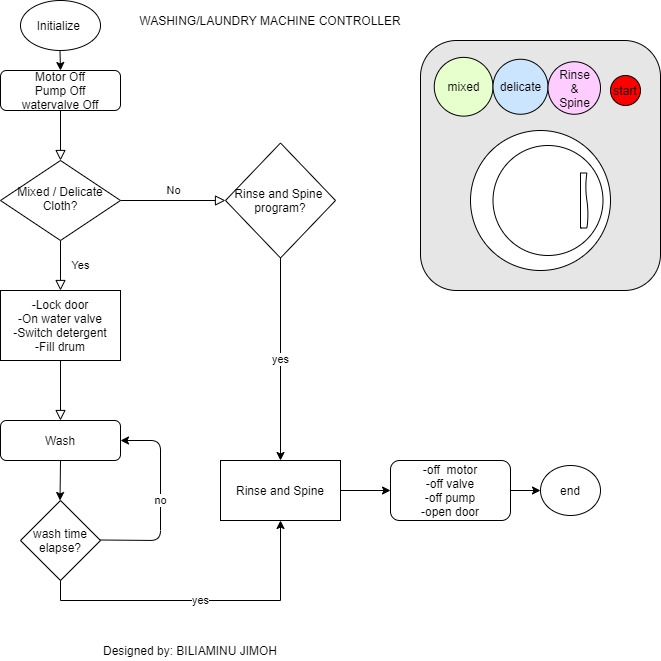

This is a basic washing machine controller which uses an STC89C52 programmed in C to control the functionality of the washing machine. There are three available programs:
mixed, delicate and (Rinse & Spine). The first two needs detergent while the last one does not. The program feature a simple embbedded operating system with the aid of an 
interrupt service routine to control timing.

sequence:

select wash program(mixed and delicate, rinse &spin)
press start button
-door lock
-open water valve
-open detergent switch(if)
-sense water level and if full close valve or when time elapse at this stage
-turn on washer motor(stop after all cycle)
-switch ON pump to drain water. Off when drum is empty
Stop.
Here is the microcontroller board used: 

OUTPUT PINS

sbit Control_derterget_switch = P2^0;
sbit Control_door_switch = P2^1;
sbit Control_motor_switch = P2^2;
sbit Control_pump_switch = P2^3;
sbit Control_watervalve_switch = P2^4;

INPUT PINS
selector switches

sbit select1= P1^1;
sbit select2= P1^0;
sbit select3= P1^2;

Start Switch

sbit Start_pin = P1^3;
sbit water_level = P1^4;

